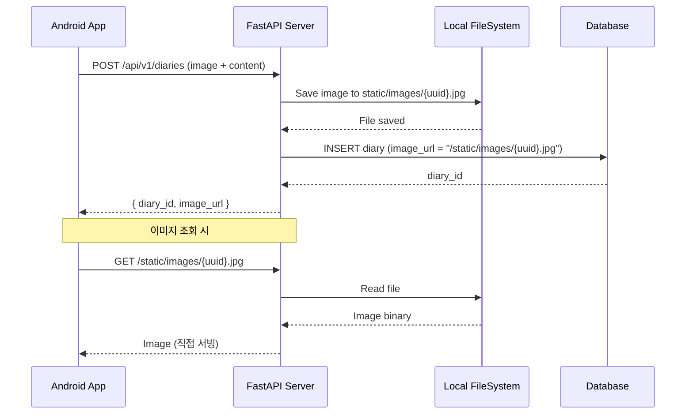

# 📸 Image Storage Architecture

## Overview
이 프로젝트는 **로컬 파일 시스템**에 이미지를 저장합니다. (AWS S3 사용 안 함)

---

## Architecture Diagram



---

## Storage Details

| 항목 | 값 |
|------|-----|
| **저장 위치** | `{project_root}/static/images/` |
| **파일명 규칙** | UUID + 원본 확장자 (예: `a1b2c3d4-e5f6-....jpg`) |
| **접근 경로** | `http://{host}:{port}/static/images/{filename}` |
| **DB 저장 값** | 전체 URL 문자열 (예: `http://localhost:8000/static/images/uuid.jpg`) |

---

## Key Components

### 1. File Utility (`app/common/files.py`)
```python
async def save_upload_file(file: UploadFile) -> Optional[str]:
    # 1. UUID로 고유 파일명 생성
    # 2. static/images/에 저장
    # 3. 접근 가능한 URL 반환
```

### 2. Static Files Mount (`main.py`)
```python
from fastapi.staticfiles import StaticFiles

app.mount("/static", StaticFiles(directory="static"), name="static")
```

### 3. Database Schema
```sql
-- 실제 이미지 Binary는 저장하지 않음!
-- URL 문자열만 저장
CREATE TABLE diaries (
    id SERIAL PRIMARY KEY,
    image_url VARCHAR(512),  -- "http://localhost:8000/static/images/uuid.jpg"
    ...
);
```

---

## Important Notes

> [!WARNING]
> **운영 환경 배포 시 주의사항**
> - 로컬 저장은 서버 재시작 시 파일이 유지되지만, 컨테이너/서버리스 환경에서는 파일이 사라질 수 있음
> - 운영 환경에서는 **AWS S3, GCS, 또는 NFS** 같은 영구 스토리지로 마이그레이션 권장

> [!NOTE]
> **현재 URL 생성 방식**
> - `http://{HOST}:{PORT}/static/images/{uuid}.ext` 형태
> - HOST가 `0.0.0.0`인 경우 `localhost`로 치환됨
> - 실제 배포 시 도메인 환경변수 추가 필요

---

## File Locations

| File | Role |
|------|------|
| [app/common/files.py](file:///c:/ssafy/project-first/S14P11D101/BE/farmily-fastapi/app/common/files.py) | 파일 저장 유틸리티 |
| [main.py](file:///c:/ssafy/project-first/S14P11D101/BE/farmily-fastapi/main.py) | StaticFiles 마운트 설정 |
| [static/images/](file:///c:/ssafy/project-first/S14P11D101/BE/farmily-fastapi/static/images) | 실제 이미지 저장 디렉토리 |
