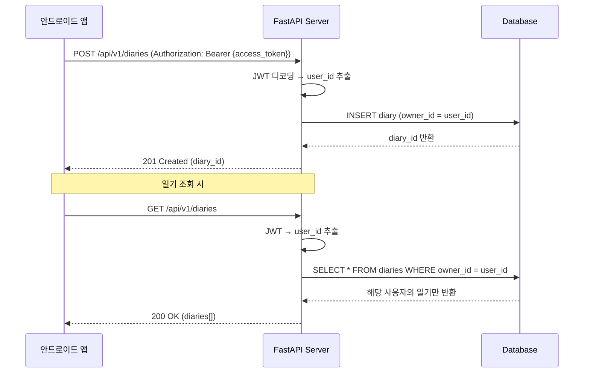

# 🔐 JWT Authentication Design

## 1. Overview

이 문서는 **반려식물 일기(Growth Diary) API**에서 사용할 JWT(JSON Web Token) 인증 구조를 정의합니다.
핵심 목표는 **사용자가 자신의 데이터에만 접근**하도록 보장하는 것입니다.

---

## 2. JWT Token Types

| Token Type | Purpose | Expiry |
|------------|---------|--------|
| **Access Token** | API 요청 인증에 사용 | 15분 ~ 1시간 (권장: 30분) |
| **Refresh Token** | Access Token 갱신용 | 7일 ~ 30일 (권장: 14일) |

---

## 3. Access Token Payload (Claims)

```json
{
  "sub": "user_123",
  "user_id": 123,
  "username": "plant_lover",
  "role": "user",
  "iat": 1706345678,
  "exp": 1706347478
}
```

### Field Descriptions

| Claim | Type | Required | Description |
|-------|------|----------|-------------|
| `sub` | String | ✅ | Subject - 사용자 고유 식별자 (문자열 형태) |
| `user_id` | Int | ✅ | **DB User PK** - 일기 소유권 확인에 사용 |
| `username` | String | ❌ | 사용자명 (로깅/표시용, 선택적) |
| `role` | String | ✅ | 권한 레벨 (`user`, `admin` 등) |
| `iat` | Int | ✅ | Issued At - 토큰 발급 시간 (Unix timestamp) |
| `exp` | Int | ✅ | Expiration - 토큰 만료 시간 (Unix timestamp) |

> [!IMPORTANT]
> **`user_id`는 필수입니다.** 일기 CRUD 시 `diary.owner_id == jwt.user_id`를 검증해야 합니다.

---

## 4. Refresh Token Payload

```json
{
  "sub": "user_123",
  "user_id": 123,
  "type": "refresh",
  "iat": 1706345678,
  "exp": 1707555078
}
```

> [!NOTE]
> Refresh Token은 Access Token 재발급에만 사용되며, API 요청 인증에는 사용하지 않습니다.

---

## 5. API에서 JWT 사용 흐름



---

## 6. Database Schema Implication

JWT의 `user_id`를 사용하려면 **Diary 테이블에 `owner_id` 컬럼**이 필요합니다.

```sql
CREATE TABLE diaries (
    id SERIAL PRIMARY KEY,
    owner_id INTEGER NOT NULL REFERENCES users(id),  -- JWT user_id와 매칭
    content TEXT NOT NULL,
    image_url VARCHAR(512),
    recorded_at TIMESTAMPTZ NOT NULL,
    created_at TIMESTAMPTZ DEFAULT NOW(),
    updated_at TIMESTAMPTZ
);
```

---

## 7. FastAPI Dependency Example

```python
from fastapi import Depends, HTTPException, status
from fastapi.security import HTTPBearer, HTTPAuthorizationCredentials
from jose import jwt, JWTError
from app.core.config import settings

security = HTTPBearer()

async def get_current_user(
    credentials: HTTPAuthorizationCredentials = Depends(security)
) -> dict:
    """JWT에서 현재 사용자 정보를 추출합니다."""
    token = credentials.credentials
    try:
        payload = jwt.decode(
            token,
            settings.JWT_SECRET_KEY,
            algorithms=[settings.JWT_ALGORITHM]
        )
        user_id: int = payload.get("user_id")
        if user_id is None:
            raise HTTPException(
                status_code=status.HTTP_401_UNAUTHORIZED,
                detail={"error_code": "AUTH_TOKEN_INVALID", "message": "인증 정보가 유효하지 않습니다."}
            )
        return {"user_id": user_id, "role": payload.get("role", "user")}
    except JWTError:
        raise HTTPException(
            status_code=status.HTTP_401_UNAUTHORIZED,
            detail={"error_code": "AUTH_TOKEN_INVALID", "message": "인증 정보가 유효하지 않습니다."}
        )
```

---

## 8. Environment Variables

`.env` 파일에 아래 설정을 추가해야 합니다.

```ini
JWT_SECRET_KEY=your-super-secret-key-change-in-production
JWT_ALGORITHM=HS256
ACCESS_TOKEN_EXPIRE_MINUTES=30
REFRESH_TOKEN_EXPIRE_DAYS=14
```

---

## 9. Security Considerations

| 항목 | 권장 사항 |
|------|----------|
| **Secret Key** | 최소 32자 이상의 랜덤 문자열 사용 |
| **Algorithm** | `HS256` (대칭키) 또는 `RS256` (비대칭키, 더 안전) |
| **HTTPS** | 운영 환경에서 필수 - 토큰 탈취 방지 |
| **Token Storage** | 앱에서는 Secure Storage 사용 (SharedPreferences X) |
