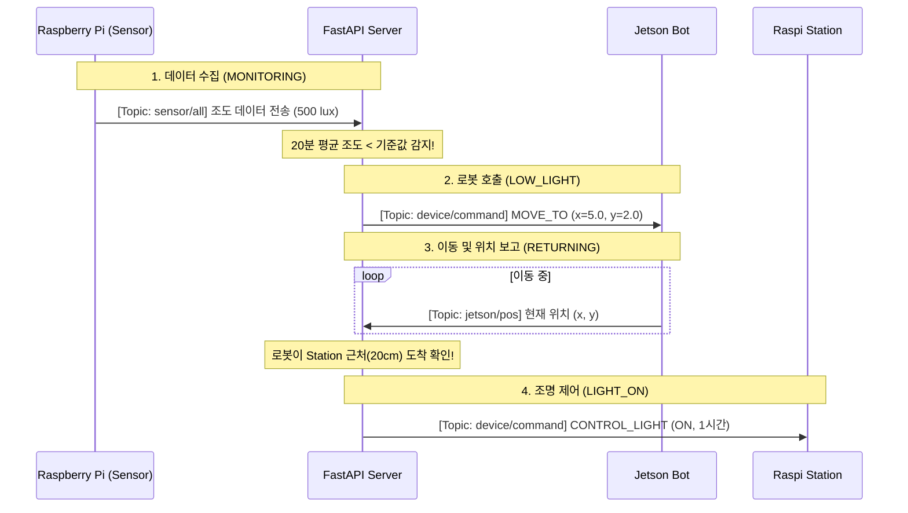

# MQTT Service Documentation

## 💡 Light Control Service (식물등 자동 제어)

조도 센서 데이터를 분석하여 빛이 부족할 때 로봇을 Station으로 호출하고, 도착 시 인공조명을 켜는 서비스입니다.

### 🔄 전체 흐름 (Flow)



---

### 📡 주요 메시지 포맷

#### 1. 센서 데이터 (입력)
*   **Topic**: `farmily/raspi/sensor/all`
```json
{"payload": {"illuminance": 500, "temperature": 25, ...}}
```

#### 2. MOVE_TO (로봇 이동 명령)
*   **Topic**: `farmily/devices/device_1/command`
*   **Condition**: 조도 평균이 부족할 때 발생
```json
{
  "header": {"type": "command", "device_id": "jetson_bot"},
  "payload": {
    "cmd": "MOVE_TO",
    "params": {"x": 5.0, "y": 2.0}
  }
}
```

#### 3. CONTROL_LIGHT (조명 제어 명령)
*   **Topic**: `farmily/devices/device_1/command`
*   **Condition**: 로봇이 Station에 도착했을 때 발생
```json
{
  "header": {"type": "command", "device_id": "raspi_station"},
  "payload": {
    "cmd": "CONTROL_LIGHT",
    "params": {"state": "ON", "duration": 3600}
  }
}
```
