## 3D 프린터 출력 결과 및 조립 구조

예상 출력 시간이 길어 단일 출력 대신  
부품을 분리한 **조립식 구조**로 3D 프린터 출력을 진행함  

각 파트는 출력 후 결합을 전제로 설계되었으며  
배선, LCD, 카메라 장착을 고려한 구조로 구성됨

---

### 1. 하단부

전체 구조를 지지하는 베이스 파트  
전자 부품과 상단 외벽을 안정적으로 고정하기 위한 하단 프레임 역할을 함

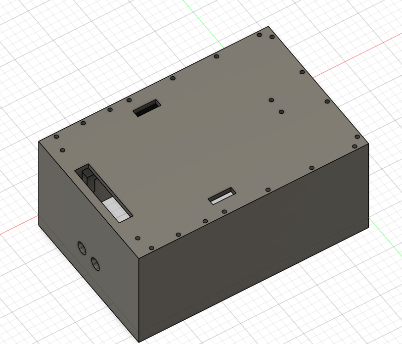

---

### 2. 상단 외벽 1

상단을 감싸는 외벽 파트 중 하나  
조립식 구조를 위해 여러 조각으로 분할하여 출력함

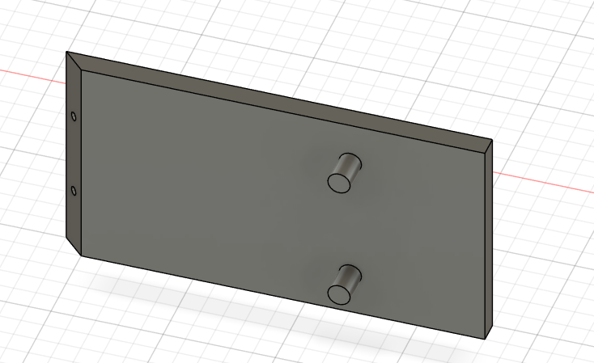

---

### 3. 상단 외벽 2

외벽의 다른 면을 구성하는 파트  
하단부와 결합되어 전체 외형을 형성함 

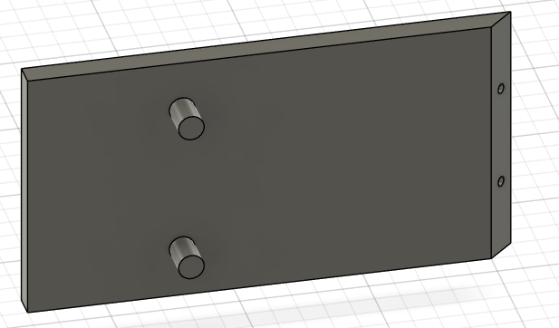

---

### 4. 상단 외벽 3

상단 외벽의 마지막 파트  
조립 시 전체 외벽이 하나의 구조로 이어지도록 설계됨

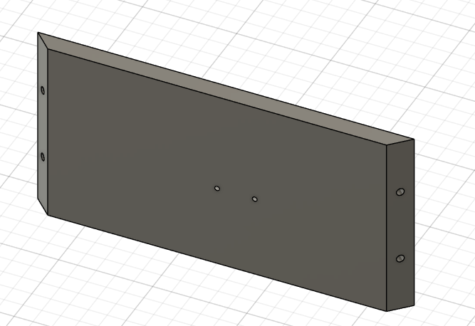

---

### 5. 배선 연결 구멍

외부 전원 및 센서 배선을 통과시키기 위한 홀  
조립 후에도 배선 정리가 가능하도록 위치를 고려해 설계함  

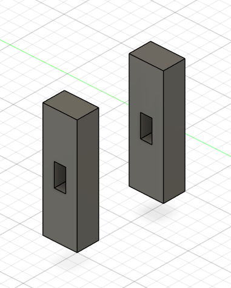

---

### 6. LCD 화면

상단에 부착되는 LCD 화면 파트  
정보 표시 및 UI 출력을 위한 위치로 설계됨

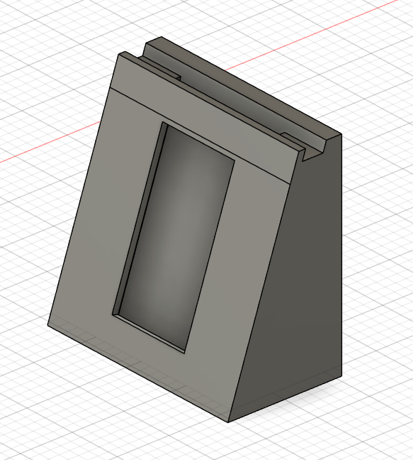

---

### 7. LCD 화면 하단부

LCD를 지지하고 고정하기 위한 하단 구조물  
화면 흔들림을 방지하고 안정적으로 결합되도록 설계함

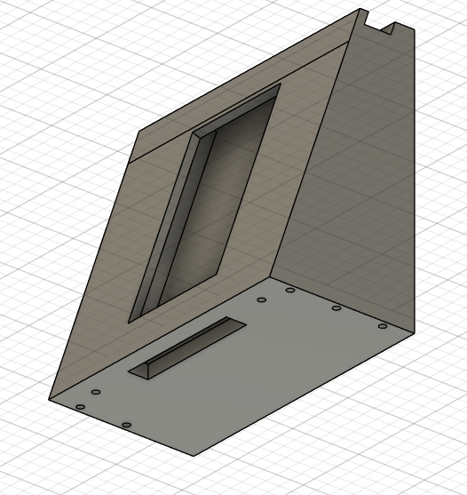

---

### 8. LCD 화면 덮개 및 카메라 부착부

LCD를 보호하는 덮개와  
카메라 장착을 동시에 고려한 상단 커버 파트

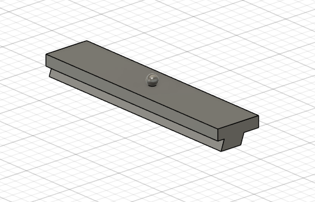

---

### 9. 상단 덮개

스마트팜 상단을 보호하기 위한 커버 파트
외부 환경으로부터 내부 전자 부품과 배선을 보호하는 역할을 함

물 튐이나 먼지가 내부로 유입되는 것을 최소화하기 위해 상단을 덮는 구조로 설계하였으며 배선이 외부에서 직접 보이지 않도록 가려주는 형태로 제작함

또한 결합 구조를 적용하여 조립과 분해가 가능하도록 설계하였고 유지보수 시 내부 부품에 쉽게 접근할 수 있도록 고려함

외형적으로도 배선이 노출되지 않아 스마트팜 전체 디자인을 깔끔하게 정리해주는 역할을 수행함

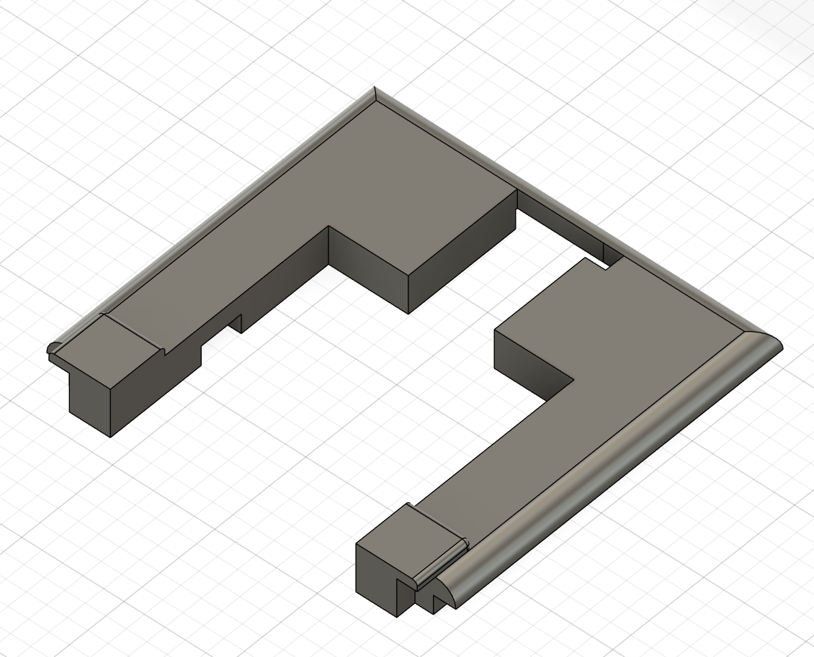

### 10. 조립 후 예상 모습

모든 파트를 조립했을 때의 전체 예상 형태  
센서, LCD, 카메라가 결합된 최종 외형을 확인할 수 있음

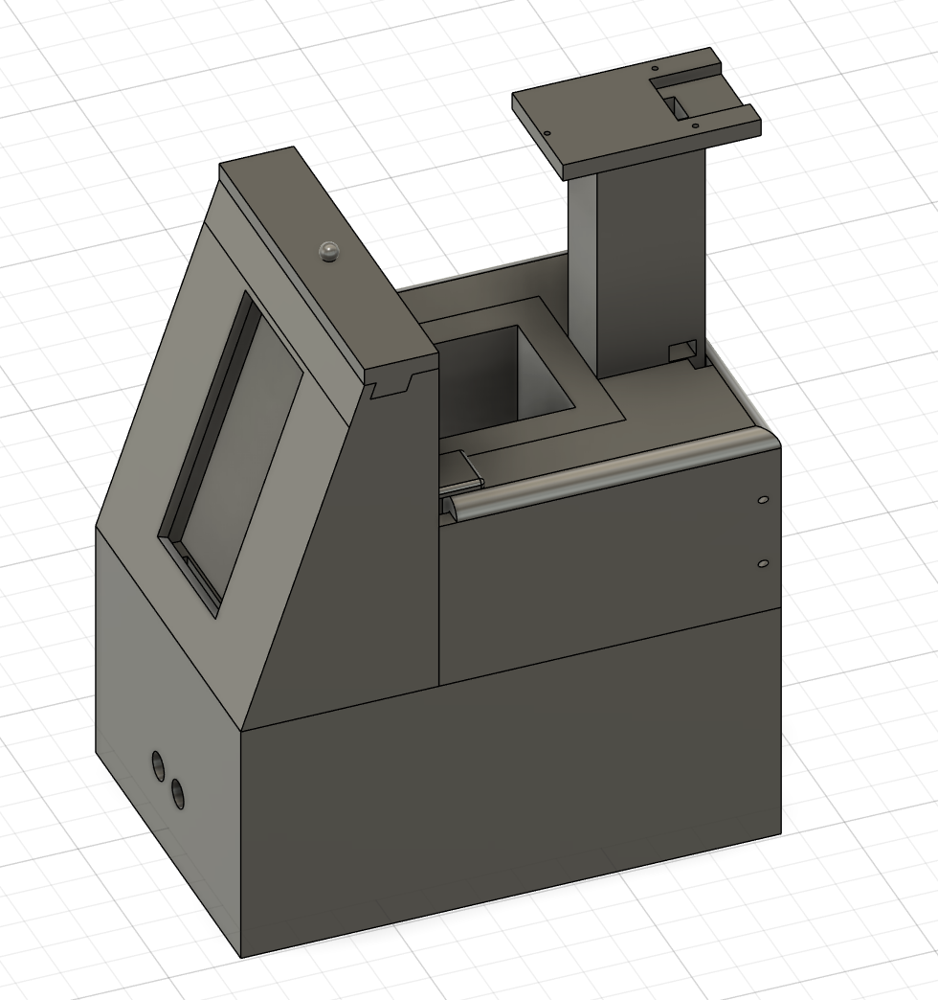

### 11. 스테이션 하단부

스테이션의 전체 구조를 지지하는 베이스 파트
라즈베리파이, 전원부, 각종 센서 제어 보드를 수납하기 위한 공간으로 설계됨

하단부는 무게 중심을 잡아주는 역할을 하며 상단 기둥이 안정적으로 고정될 수 있도록 결합 구조가 포함됨

내부 배선이 정리될 수 있도록 케이블 통로와 장착 공간을 고려해 제작함

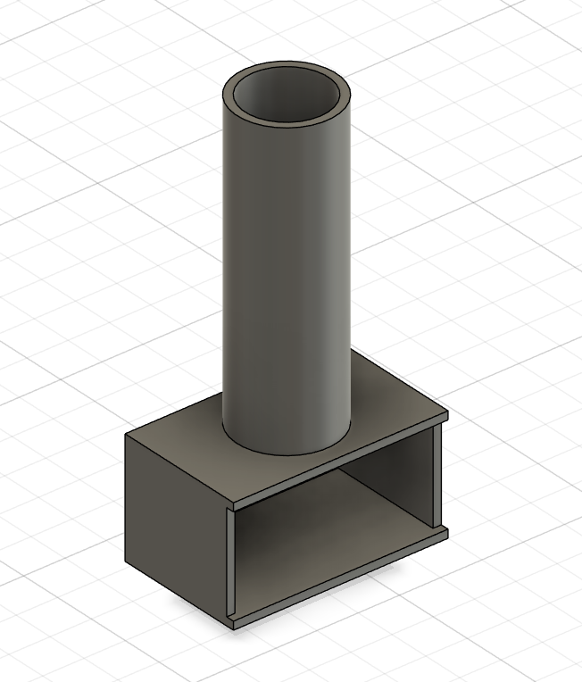
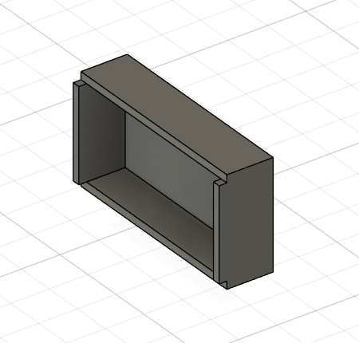

### 12. 스테이션 중단부

하단 베이스와 상단 모듈을 연결하는 원통형 기둥 구조의 중간 파트

기둥 내부는 속이 빈 구조로 설계되어 전원선과 센서 배선이 상단으로 통과할 수 있음

전체 스테이션의 중심 축 역할을 하며 상단 거치대를 안정적으로 지지하도록 설계됨

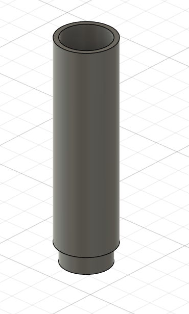

### 13. 스테이션 상단부

LED와 카메라가 장착되는 스테이션의 상단 거치대 파트

식물 방향을 향해 LED와 카메라를 배치할 수 있도록 각도 조절이 가능한 구조로 설계됨

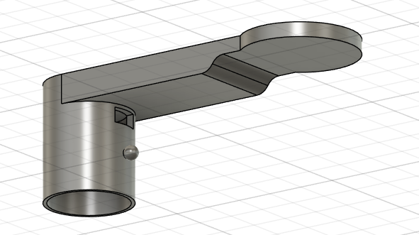

### 14. 스테이션 최종 모습

하단 베이스, 중단 기둥, 상단 거치대가 결합된 스테이션의 전체 조립 형태

하단에는 전자 부품과 배터리가 수납되고 기둥 내부를 통해 배선이 상단으로 연결됨

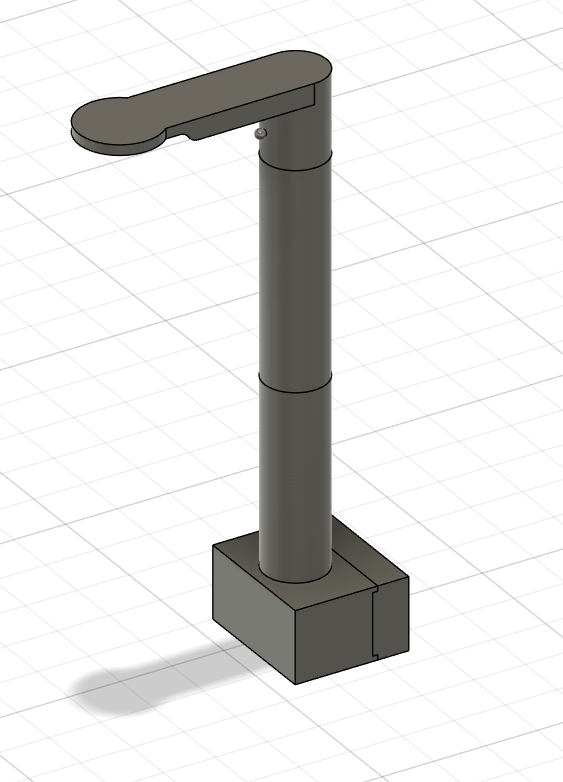

### 15. 완성 예상 모습

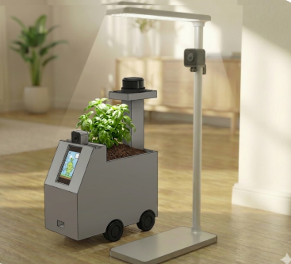